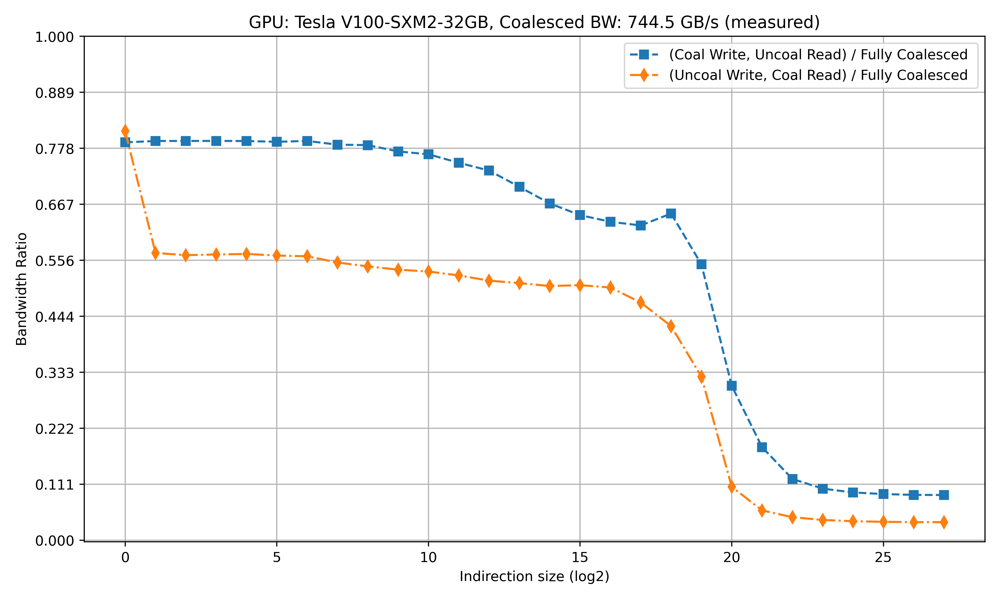
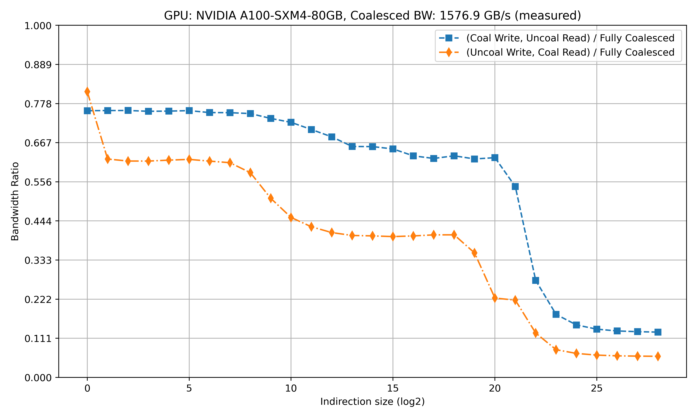

# GPU Uncoalesced Bandwidth Benchmark

## 1. Benchmark Explanation

This benchmark compares the memory bandwidth (BW) of several access patterns using Kokkos:

### Coalesced Read/Write (Baseline)
```cpp
KOKKOS_LAMBDA(const _SIZE_ i) {
    write(i) = read(i);
}
```

### Uncoalesced Read
```cpp
KOKKOS_LAMBDA(const _SIZE_ i) {
    _SIZE_ rindex = indirections(i);
    write(i) = read(rindex);
}
```

### Uncoalesced Write
```cpp
KOKKOS_LAMBDA(const _SIZE_ i) {
    _SIZE_ rindex = indirections(i);
    write(rindex) = read(i);
}
```

The benchmark varies the random indirection size from `0` to the full vector size. The vector size is 2^28 doubles, which should fully utilize GPU memory bandwidth: Increasing the size beyond this point no longer improves throughput. 

---

## 2. Benchmark Results

All plots generated from the benchmark are saved in the `results/` folder. Each plot corresponds to a GPU and visualizes:

- Uncoalesced Write / Read ratio
- Uncoalesced Read / Coalesced ratio
- Uncoalesced Write / Coalesced ratio  

Note: Coalesced BW exceeds H100 BW (2TB/s), i was unable to erase cache... . I suspect A100 BW is skewed too, great caches ! :)





---

## 3. Interpretation (courtesy of Florent Duguet @ Nvidia)
During non-coalesced read access, the various caches are populated with data, but different SMs accessing different data from the same cache line only replicate the read (from L2 cache to L1 cache). In the case of a write access, the L1 caches must be merged into the L2 cache to maintain coherence, which requires additional processing by the memory units.

## 4. Compilation and Run Instructions

### Requirements
- Python 3 with `numpy` and `matplotlib`
- CMake
- Kokkos-enabled GPU (NVIDIA or AMD)

### Build Steps
```bash
mkdir build
cd build
cmake -DKokkos_ENABLE_CUDA=ON ..        # for NVIDIA GPUs
# OR
cmake -DKokkos_ENABLE_HIP=ON ..         # for AMD GPUs
make
```

### Run the Benchmark
```bash
./../run-bench.sh
```

The plot will be saved as `results/GPU_NAME_ratios.png`.

---
